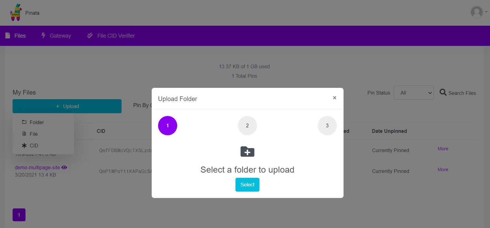

# Project 2D Create NFT Project and Deploy on OpenSea


We will follow below steps:

1) Compile and Deploy NFT Contract
2) Create your art images and place them in `assets` folder
3) Create Account on Pinata
4) Upload your NFT images or Art work on Pinata
5) Update `data.ts` file for your data and image files (Steps from here depends on how you want to manage images and metadata)
6) Run create-metadata.ts, assuming you have only two properites, otherwise change in this file
7) Upload json files generated in previous step
8) Add deployed NFT address in `generate-nfts.ts` file
9) Add address for initial owner for NFTs in `generate-nfts.ts` file
10) Run generate-nfts.ts to initialize nfts with metadata generated
11) Go to [opensea.io](https://testnets.opensea.io/get-listed/step-two) Testnet
12) Provide your contract address
13) Result will be something like [this](https://testnets.opensea.io/collection/shapenft)


### 1) Compile and Deploy
```shell
npx hardhat compile
tsc
npx hardhat run dist/scripts/deploy.js
```

### 2) Create your art images and place them in `assets` folder
Create yoru art images with unique featuers and place them in `assets` folder. Name of image file is important as we will use these name in our metadata. Therefore in our example we are using pattern like `01_triangle_light_yellow.png`, `01` to keep files in sequence and any name after that

### 3) Create Account on Pinata
We will use [Pinata](https://www.pinata.cloud/) to upload images on IPFS

### 4) Upload your NFT images or Art work on Pinata
Once you upload your complete folder in Pinata it will give CID/Hash. And you can access your file like `ipfs://Hash/File Name in your folder`
In our case `ipfs://QmfFDBWoVQc1X5Lzdqv9XsbzdrHtvp4uAHNjqJq1gPqcNV/01_triangle_light_yellow.png`
We will need this CID/hash in `Step 6`





### 5) Update `data.ts` file for your data and image files
In `scripts/data.ts` file we have array of shapes which will be used to generate metadata, it has three properties, `name`, `color`,`imageName`. If you want to add more metadata then you can add these properties here but than you have to update `create-metadata.ts` file explained in `Step 6`.
`imageName` properties is used just for metadata creating it will not be part of metadata
```JS
export const shapes = [
    {
        name:"Triangle",
        color: "Light Yellow",
        imageName: "01_triangle_light_yellow.png"
    },
    ...
}
```

`scripts/data.ts` also has metadata template object, if you want to added or change metadata properties then you have to update this object as well


### 6) Update and executed `create-metadata.ts`
`create-metadata.ts` file will create metadata folder and generate all the metadata files in this folder.
You can customize this according to your needs of metadata properties.
On line 18 of `create-metadata.ts` file you have to change CID/Hash of your folder which you will receive in `Step 4`
```JS
shapeMetadata.image=`ipfs://QmfFDBWoVQc1X5Lzdqv9XsbzdrHtvp4uAHNjqJq1gPqcNV/${shapes[i].imageName}`;
```
Replace the above hash with hash of yoru folder on Pinata

### 7) 
### 8) 
### 9) 
### 10) 
### 11) 
### 12) 

Try running some of the following tasks:

```shell
npx hardhat accounts
npx hardhat compile
npx hardhat clean
npx hardhat test
npx hardhat node
node scripts/sample-script.js
npx hardhat help
```
