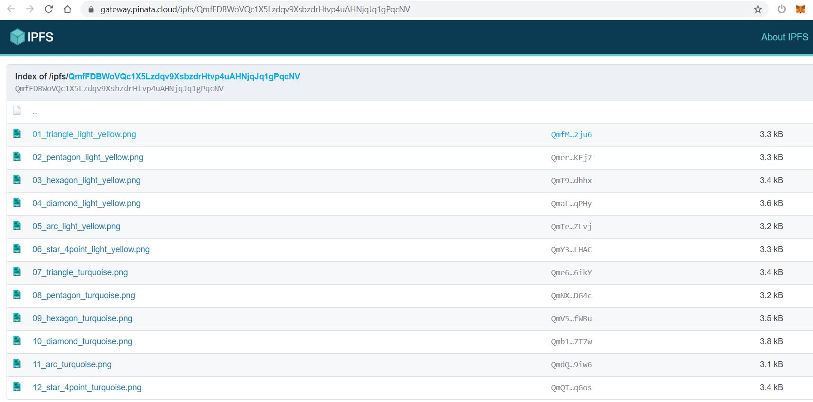
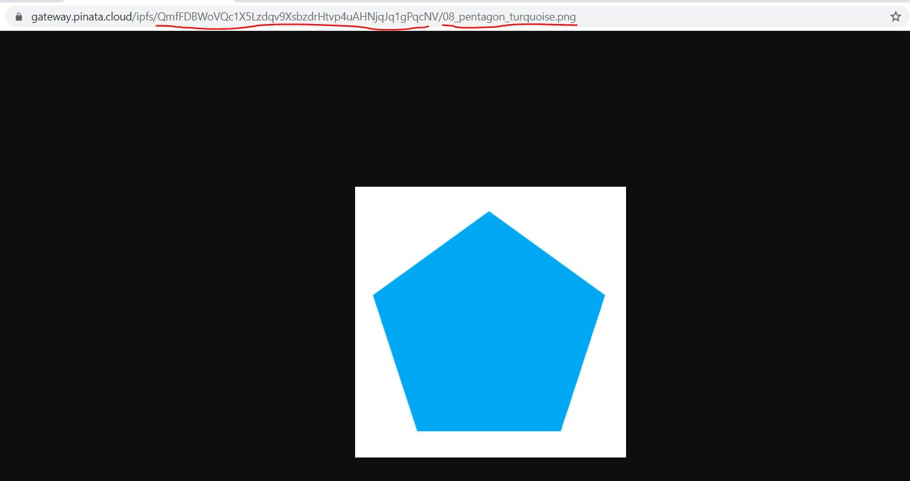
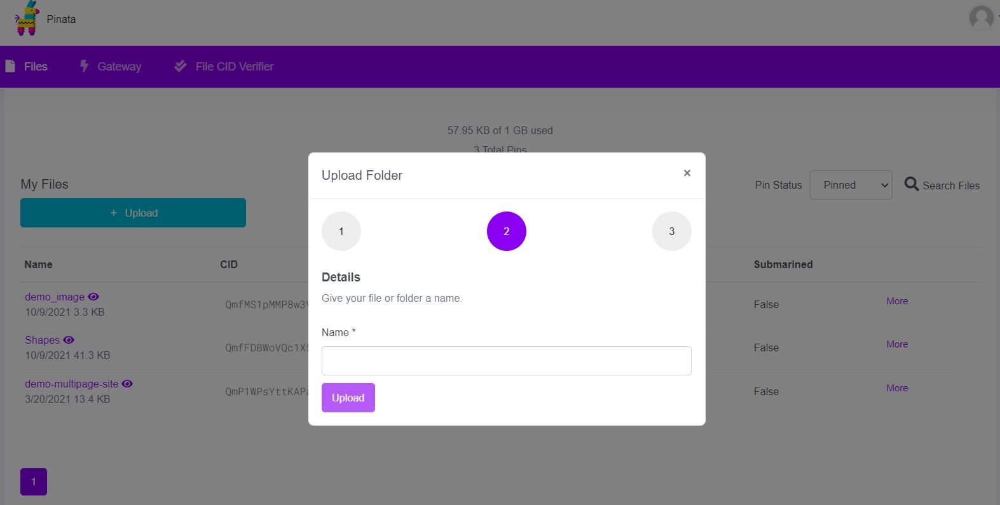
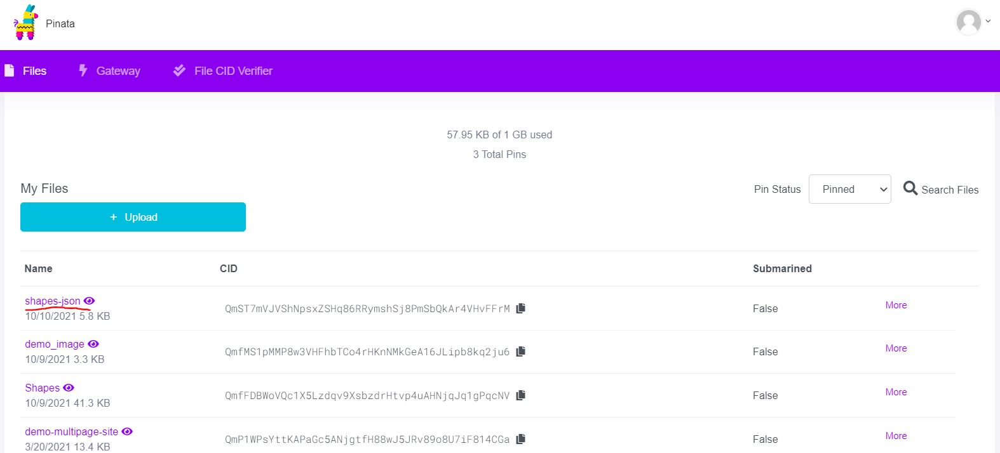
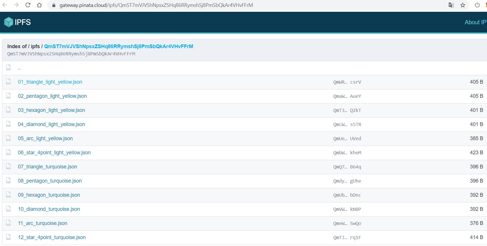

# Project 3 Create NFT Project and Deploy on OpenSea


We will follow below steps:

1) Provide INFURA Key and RINKEBY key in .env file
2) Compile and Deploy NFT Contract
3) Create your art images and place them in `assets` folder
4) Create Account on Pinata
5) Upload your NFT images or Art work on Pinata
6) Update `data.ts` file for your data and image files (Steps from here depends on how you want to manage images and metadata)
7) Run create-metadata.ts, assuming you have only two properites, otherwise change in this file
8) Upload json files generated in previous step
9) Add deployed NFT address in `generate-nfts.ts` file
10) Add address for initial owner for NFTs in `generate-nfts.ts` file
11) Execute generate-nfts.ts to Mint NFTs with metadata generated
12) Add your NFT on Opensea Testnet

### 1) Provide INFURA Key and RINKEBY key in .env file
Provide values to following keys<br>
INFURA_KEY<br>
RINKEBY_PRIVATE_KEY<br>

### 2) Compile and Deploy
```shell
npx hardhat compile
tsc
npx hardhat run dist/scripts/deploy.js --network rinkeby
```

### 3) Create your art images and place them in `assets` folder
Create yoru art images with unique featuers and place them in `assets` folder. Name of image file is important as we will use these name in our metadata. Therefore in our example we are using pattern like `01_triangle_light_yellow.png`, `01` to keep files in sequence and any name after that

### 4) Create Account on Pinata
We will use [Pinata](https://www.pinata.cloud/) to upload images on IPFS

### 5) Upload your NFT images or Art work on Pinata
Once you upload your complete folder in Pinata it will give CID/Hash. And you can access your file like `ipfs://Hash/File Name in your folder`<br>
In our case `ipfs://QmfFDBWoVQc1X5Lzdqv9XsbzdrHtvp4uAHNjqJq1gPqcNV/01_triangle_light_yellow.png`<br>
We will need this CID/hash in `Step 6`





### 6) Update `data.ts` file for your data and image files
In `scripts/data.ts` file we have array of shapes which will be used to generate metadata, it has three properties, `name`, `color`,`imageName`. If you want to add more metadata then you can add these properties here but than you have to update `create-metadata.ts` file explained in `Step 6`.
`imageName` properties is used just for metadata creating it will not be part of metadata
```JS
export const shapes = [
    {
        name:"Triangle",
        color: "Light Yellow",
        imageName: "01_triangle_light_yellow.png"
    },
    ...
}
```

`scripts/data.ts` also has metadata template object, if you want to added or change metadata properties then you have to update this object as well


### 7) Update and execute `create-metadata.ts`
`create-metadata.ts` file will create metadata folder and generate all the metadata files in this folder.<br>
You can customize this according to your needs of metadata properties.<br>
On line 18 of `create-metadata.ts` file you have to change CID/Hash of your folder which you will receive in `Step 4`
```JS
shapeMetadata.image=`ipfs://QmfFDBWoVQc1X5Lzdqv9XsbzdrHtvp4uAHNjqJq1gPqcNV/${shapes[i].imageName}`;
```
Replace the above hash with hash of yoru folder on Pinata

Then run following command to generate metadata
```shell
npx hardhat run scripts/create-metadata.ts
```

### 8) Upload json files generated in Step 6
Upload complete folder of metadata on Pinata.<br>
Note: again we will keep the pattern and our file will be accessible with this URL ipfs://QmST7mVJVShNpsxZSHq86RRymshSj8PmSbQkAr4VHvFFrM/01_triangle_light_yellow.json







### 9) Add deployed NFT address in `generate-nfts.ts` file
On line 7 of `generate-nfts.ts` replace NFT address with your deployed NFT address, which was generated in Step 1

### 10) Add address for initial owner for NFTs in `generate-nfts.ts` file
On line 11 of `generate-nfts.ts` provide address of your Ethereum account on which initial NFT's will be minted 

### 11) Execute `generate-nfts.ts` to Mint nfts with generated metadata
Run following command to mint NFTs
```shell
npx hardhat run scripts/generate-nfts.ts --network rinkeby
```
This will mint NFTs on your account

### 12) Add your NFT on Opensea Testnet
For Mainnet go to this [link](https://opensea.io/get-listed/step-two)<br>
To add your NFT on Opensea Testnet go to this [link](https://testnets.opensea.io/get-listed/step-two)<br>
Select Rinkeby Network and Provide your contract address generated in `Step 1`<br>
Once done you will see your NFT collection on Opnesea.io like [this](https://testnets.opensea.io/collection/shapenft)


## Reference Links
[How To Create NFTs With Solidity](https://betterprogramming.pub/how-to-create-nfts-with-solidity-4fa1398eb70a)
[Build, Deploy, and Sell Your Own Dynamic NFT](https://blog.chain.link/build-deploy-and-sell-your-own-dynamic-nft/)
[HOW TO WRITE & DEPLOY AN NFT](https://ethereum.org/en/developers/tutorials/how-to-write-and-deploy-an-nft/)